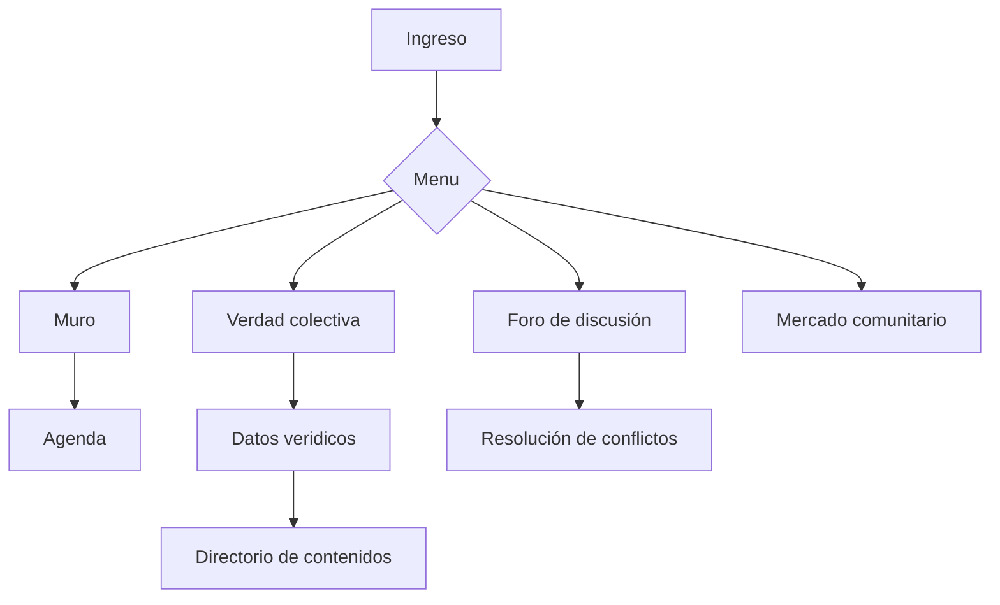

# Justicialismo.cc 

## Concepto de Prueba

 - Introducción
 - Conceptos básicos de Software Libre
 - - Licencia
 - Paralelismos entre Justicialismo y Software libre
 - - La organización vence al tiempo
 - - Comunidad Organizada
 - Una herramienta para el conocimiento colectivo
 - - Valor del contenido
 - Desarrollo
 - - Estructura del sitio
 - - - Muro
 - - - Agenda
 - - - Verdad colectiva 
 - - - Datos verídicos
 - - - Directorio de contenido
 - - - Mercado comunitario
 - - - Resolución de conflictos
 - - Implementación
 - Notas

## Introducción

*A fin de que nuestros dirigentes tengan a mano información, datos convenientes de distintas índoles que contribuyan con decisiones y unificando la información que se encuentra dispersa y discutida en plataformas "ajenas", el principal objetivo es obtener y recolectar datos certeros que como organización política se necesitarán. El eje se encuentra en la comunicación, aclaración, advertencia, asesoría, averiguación, indagación y testimonio, actual y real. Estableciendo filtros a intereses, calumnias, operaciones mediáticas, judiciales o políticas. Buscamos formar un espacio exclusivo de organización para el movimiento.*

## Desarrollo

### Estructura del sitio

#### Muro

En esta sección no es muy distinta a cualquier muro de las redes sociales. Es un lugar donde los compañeros comparten sus ideas y debaten propuestas que van surgiendo del día a día.

También es un lugar donde los compañeros podrán dar a conocer todas sus actividades.

#### Agenda

Un lugar donde se pueda ver de manera grafica y sencilla los eventos relacionados con la causa del Pueblo.

#### Datos verídicos

En esta parte del sitio se recopilaran todos los datos duros de cualquier tema como por ejemplos economía, política, educación, salud, seguridad, para determinar si son datos ciertos o manipulados

La categorización es muy importante para tener búsquedas mas certeras a la hora de buscar algún dato.

Se podrán crear tablas de trabajo colaborativo donde cualquier compañero tiene la opción de subir algún dato, el cual sera visto por el resto para ponerle una puntuación. Esta puntuación es la que nos va a dar un panorama si el dato es certero o no.

En un futuro cuando se tengan los suficientes datos certeros, se podrá crear una ***API*** para extraer esos datos para procesarlos, crear gráficos, diseñar y ejecutas análisis de datos, etc.

> **Nota:** Una API (siglas de ‘Application Programming Interface’) es **un conjunto de reglas (código) y especificaciones que las aplicaciones pueden seguir para comunicarse entre ellas**: sirviendo de interfaz entre programas diferentes de la misma manera en que la interfaz de usuario facilita la interacción humano-software.

El objetivo de esta sección es garantizar una fuente sencilla y confiable de todos los datos para que los compañeros saquen las mejores conclusiones.

#### Verdad colectiva

Aqui los companeros podran volcar sus dudas e inquietudes, para que el resto pueda contestar si sabe la respuestas. Estas respuestas seran puntuadas por toda la Comunidad, resaltando las mejores respuestas a las mejores inquietudes.

> Existen muchos ejemplos de aplicaciones de esta manera, como **Wikianswers**, **Yahoo! Respuestas** y **Stack Exchange**

